# kotlin-spring-demo 🏝 
* [Docker Hub](https://hub.docker.com/repository/docker/taiwanbackendgroup/kotlin-spring-demo)
* this is a simple demo project for Java Spring developer who want to try Kotlin 🚀
* hope the following steps can be useful for everyone 😏
* if you have any question, you can find me via my personal landing page https://jianminhuang.cc 👨‍💻

## First Commit
* Project Setup
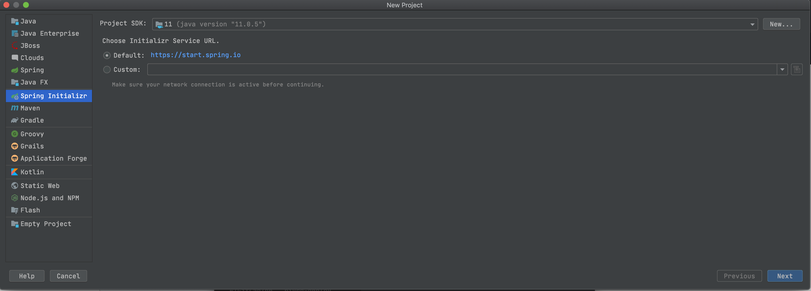
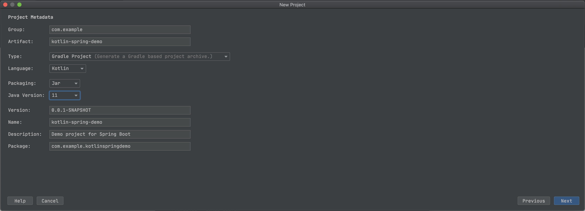
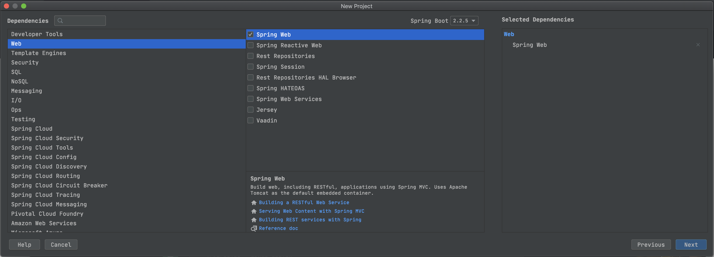
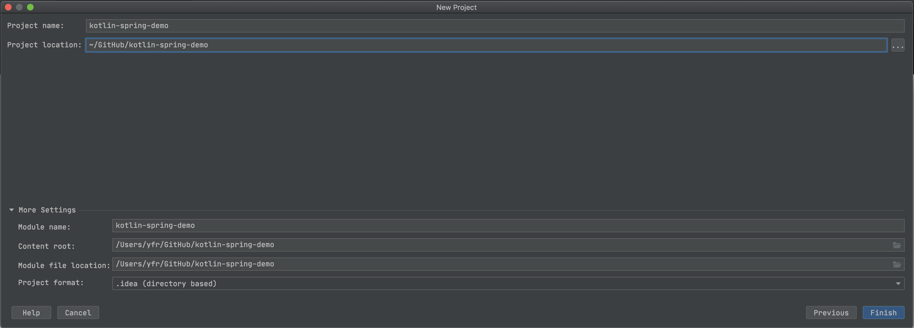

* First Run
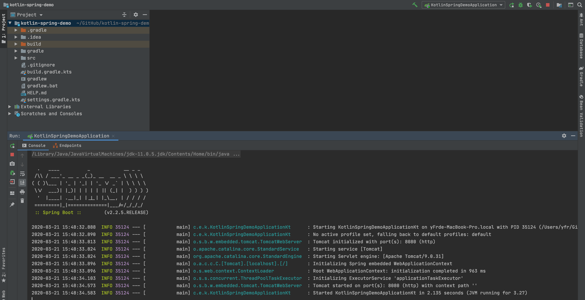

## Second Commit
* Start MySQL with Docker
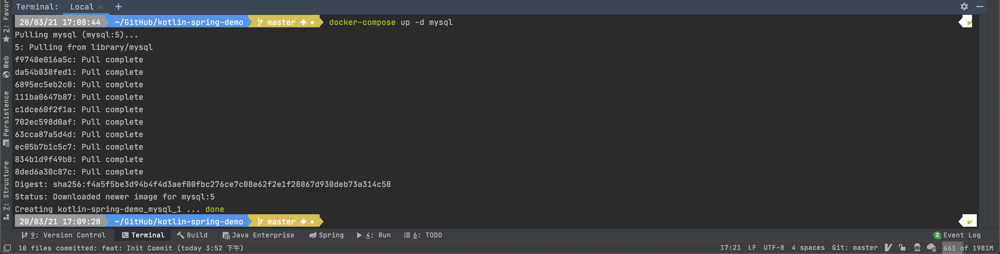

* Use IntelliJ IDEA Database to connect it
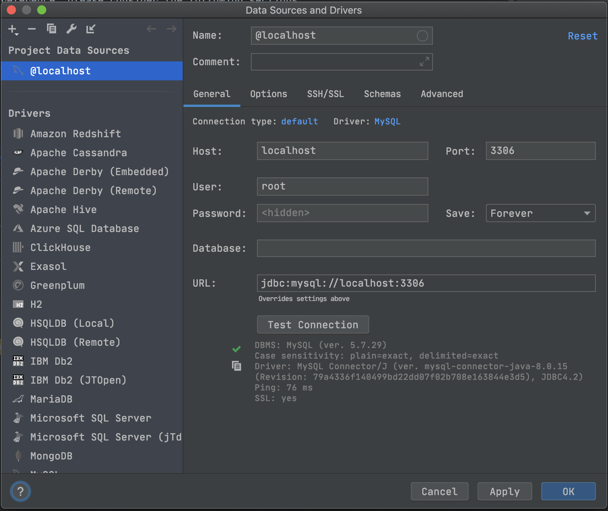

* Create a test Database 
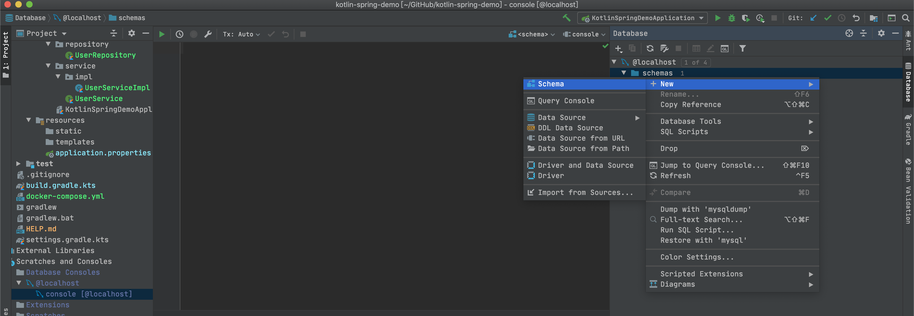
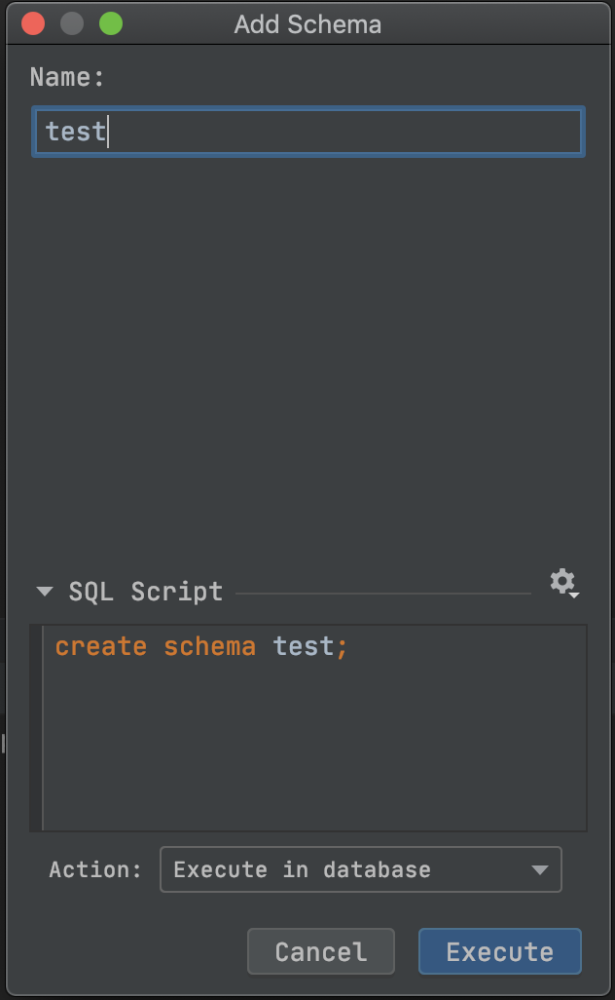

* Second Run 
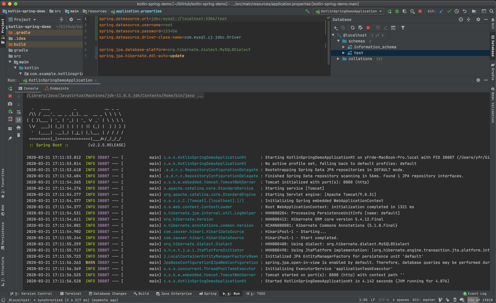

* Run script with IntelliJ IDEA HTTP client
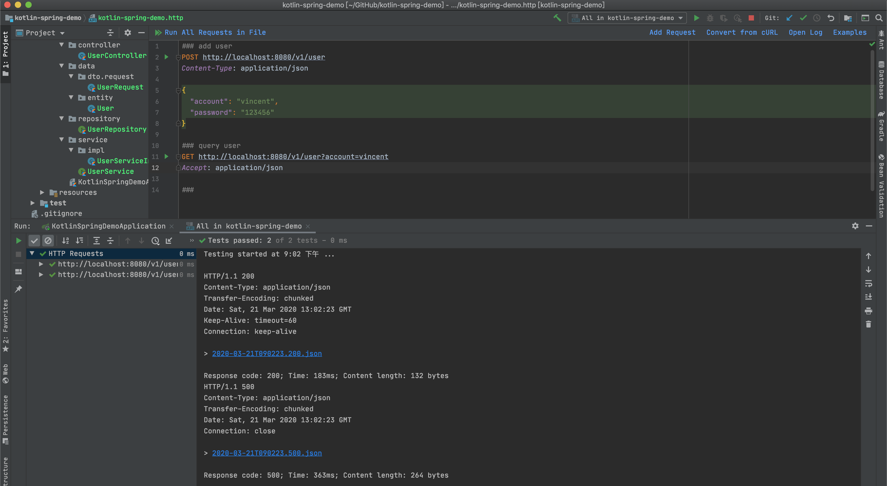

## Third Commit
* Setting GitHub Secrets
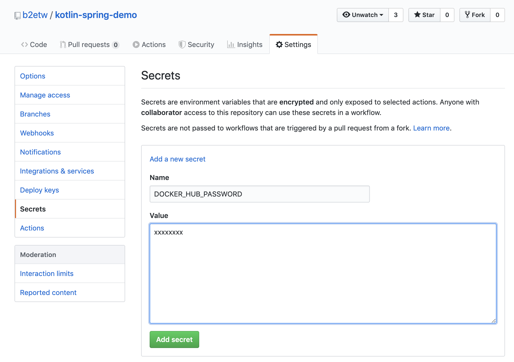

* Docker Hub image
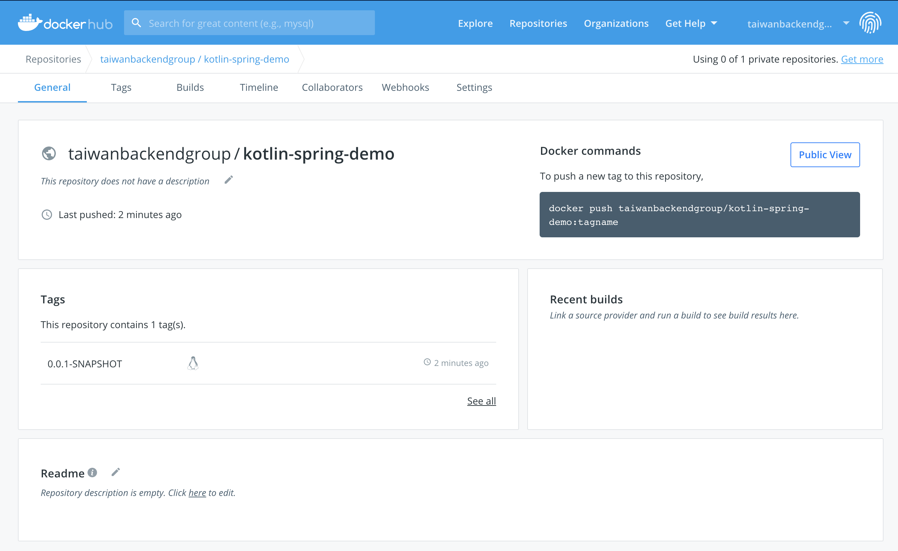